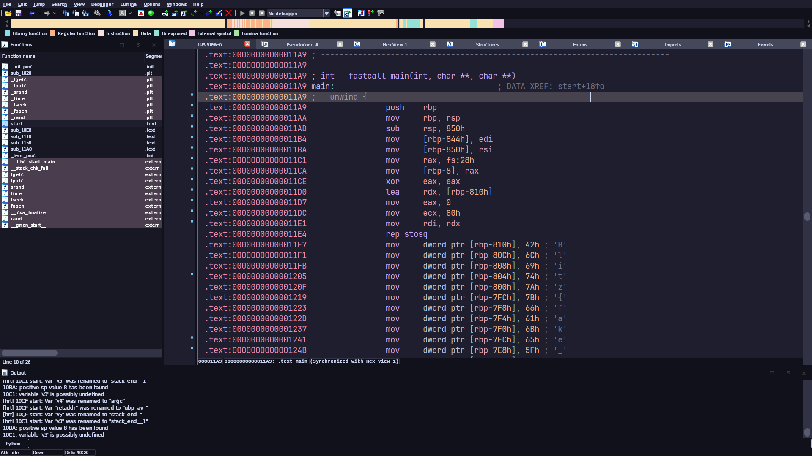
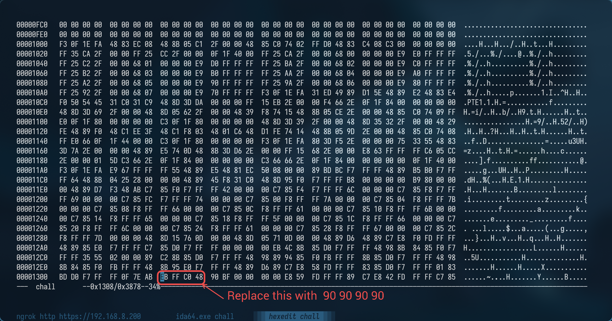

# How time flows

import Challenge from '@/components/custom/Challenge.astro'

<Challenge
  title="How time flows"
  authors={['Nolawz']}
  category="Reverse Engineering"
  points={480}
  solves={16}
  files={["chall", "flag.txt.enc"]}
  flag="Blitz{71m3_5ur3_fl0w5_f457_l1k3_4_r1v3r_50m371m35}"
>
  Time flows like a river. Don't be fooled by things you see on the surface. There might be something dangerous below the depths
</Challenge>

Running `strings` on the binary given shows that the binary was packed by [UPX](https://upx.github.io/)

```txt title="Output of strings"
...
$Info: This file is packed with the UPX executable packer http://upx.sf.net $
$Id: UPX 5.01 Copyright (C) 1996-2025 the UPX Team. All Rights Reserved. $
GCC: (GNU) 15.1
...
```

After unpacking it using `upx -d chall`, open it in IDA and decompile it. Bt as we can see, although we can see the disassembly, it fails to decompile the main function correctly.


This is a common technique to stop IDA from decompiling the binary. You can read more about it [here](https://grazfather.github.io/posts/2016-09-18-anti-disassembly/).
To mitigate this, we can replace `EB FF C0 48` in the binary with nop instructions (i.e, `90 90 90 90`).

                                           r
After that, if we open it in IDA again and try to decompile the main function, it will decompile it successfully.
```c title="Dcompilation of main in IDA"
__int64 __fastcall main(int a1, ch ar **a2, char **a3)
{            
  unsigned int seed; // eax
  int v4; // eax                  
  char v6; // [rsp+17h] [rbp-839h]    D
  int v7; // [rsp+18h] [rbp-838h]                  1
  int v8; // [rsp+1Ch] [rbp-834h]
  int v9; // [rsp+1Ch] [rbp-834h] n
  int i; // [rsp+20h] [rbp-830h]
  int j; // [rsp+24h] [rfbpain-82nCh]           0
  int k; // [rsp+28h] [rbp-828h]          a
  FILE *stream; // [rsp+30h] [rbp-820h]
  FILE *stream_1; // [rsp+38h] [rbp-818h]
  int buf[514]; // [rsp+40h] [rbp-810h] BYREF
  unsigned __int64 v16; // [rsp+848h] [rbp-8h]

  v16 = __readfsqword(0x28u);
  memset(buf, 0, 0x400uLL);
  buf[0] = 66;
  buf[1] = 108;
  buf[2] = 105;
  buf[3] = 116;
  buf[4] = 122;
  buf[5] = 123;
  buf[6] = 102;
  buf[7] = 97;
  buf[8] = 107;
  buf[9] = 101;
  buf[10] = 95;
  buf[11] = 102;
  buf[12] = 108;
  buf[13] = 97;
  buf[14] = 103;
  buf[15] = 125;
  stream = fopen("flag.txt.enc", "w");
  for ( i = 0; i <= 15; ++i )
  {
    buf[i + 256] = buf[i] ^ 0x255;
    fputc(buf[i + 256], stream);
  }
  seed = time(0LL);
  srand(seed);
  for ( j = 0; j <= 255; ++j )
  {
    buf[j] = j;
    v4 = rand();
    buf[j + 256] = (unsigned __int8)(((unsigned int)(v4 >> 31) >> 24) + v4) - ((unsigned int)(v4 >> 31) >> 24);
  }
  v8 = 0;
  for ( k = 0; k <= 255; ++k )
  {
    v8 = (buf[k + 256] + v8 + buf[k]) % 256;
    buf[k] ^= buf[v8];
    buf[v8] ^= buf[k];
    buf[k] ^= buf[v8];
  }
  v7 = 0;
  v9 = 0;
  stream_1 = fopen("flag.txt", "r");
  fseek(stream, 0LL, 0);
  while ( 1 )
  {
    v6 = fgetc(stream_1);
    if ( v6 == -1 )
      break;
    v7 = (v7 + 1) % 256;
    v9 = (v9 + buf[v7]) % 256;
    buf[v7] ^= buf[v9];
    buf[v9] ^= buf[v7];
    buf[v7] ^= buf[v9];
    fputc(buf[(buf[v9] + buf[v7]) % 256] ^ v6, stream);
  }
  return 0LL;
}
```

We can see that an array is created first and is written to flag.txt.enc after xoring each of its character with 0x255. And we can also see that it holds the string `Blitz{fake_flag}` but this is obviosly a fake flag.
If we closely examine the rest of the code, we can see that before writing again to `flag.txt.enc`, `fseek(stream, 0LL, 0);` is called, which takes the cursor to the beginning of the file. Therefore we can completely ignore that fake flag we found.

Now if we take a look at the following part of the code, we can see that it is just an implementation of [RC4](https://en.wikipedia.org/wiki/RC4) encryption but using a random key.
So we can get the flag by again using RC4 on the encrypted text with the key (which is made by using `rand()` which we can brute force)
```c collapse={1-40} {74}
__int64 __fastcall main(int a1, ch ar **a2, char **a3)
{
  unsigned int seed; // eax
  int v4; // eax
  char v6; // [rsp+17h] [rbp-839h]    D
  int v7; // [rsp+18h] [rbp-838h]                  1
  int v8; // [rsp+1Ch] [rbp-834h]
  int v9; // [rsp+1Ch] [rbp-834h] n
  int i; // [rsp+20h] [rbp-830h]
  int j; // [rsp+24h] [rfbpain-82nCh]           0
  int k; // [rsp+28h] [rbp-828h]          a
  FILE *stream; // [rsp+30h] [rbp-820h]
  FILE *stream_1; // [rsp+38h] [rbp-818h]
  int buf[514]; // [rsp+40h] [rbp-810h] BYREF
  unsigned __int64 v16; // [rsp+848h] [rbp-8h]

  v16 = __readfsqword(0x28u);
  memset(buf, 0, 0x400uLL);
  buf[0] = 66;
  buf[1] = 108;
  buf[2] = 105;
  buf[3] = 116;
  buf[4] = 122;
  buf[5] = 123;
  buf[6] = 102;
  buf[7] = 97;
  buf[8] = 107;
  buf[9] = 101;
  buf[10] = 95;
  buf[11] = 102;
  buf[12] = 108;
  buf[13] = 97;
  buf[14] = 103;
  buf[15] = 125;
  stream = fopen("flag.txt.enc", "w");
  for ( i = 0; i <= 15; ++i )
  {
    buf[i + 256] = buf[i] ^ 0x255;
    fputc(buf[i + 256], stream);
  }
  seed = time(0LL);
  srand(seed);
  for ( j = 0; j <= 255; ++j )
  {
    buf[j] = j;
    v4 = rand();
    buf[j + 256] = (unsigned __int8)(((unsigned int)(v4 >> 31) >> 24) + v4) - ((unsigned int)(v4 >> 31) >> 24);
  }
  v8 = 0;
  for ( k = 0; k <= 255; ++k )
  {
    v8 = (buf[k + 256] + v8 + buf[k]) % 256;
    buf[k] ^= buf[v8];
    buf[v8] ^= buf[k];
    buf[k] ^= buf[v8];
  }
  v7 = 0;
  v9 = 0;
  stream_1 = fopen("flag.txt", "r");
  fseek(stream, 0LL, 0);
  while ( 1 )
  {
    v6 = fgetc(stream_1);
    if ( v6 == -1 )
      break;
    v7 = (v7 + 1) % 256;
    v9 = (v9 + buf[v7]) % 256;
    buf[v7] ^= buf[v9];
    buf[v9] ^= buf[v7];
    buf[v7] ^= buf[v9];
    fputc(buf[(buf[v9] + buf[v7]) % 256] ^ v6, stream);
  }
  return 0LL;
}
```

inside the `for` loop where it initializes the buffer, we can see it also initializing key using `rand()` (btw, `buf+256` is another array).
For this it first assigns `rand()` to `v4` and then does some weird bit shifts and type changes (Though some experinced people might be able to recognize this as just modulo 256).
Even if we don't know what these weird bit shifts and type changes do, we can now write a script to brute force the seed and solve this challenge.

Here is the solution script I wrote to solve this challenge:
```python title="solve.py"
from ctypes import CDLL, c_uint, c_uint8
from time import time

libc = CDLL("libc.so.6")


def RC4(message, key):
    S = [i for i in range(256)]
    c = ""
    T = []

    for i in range(256):
        T.append(key[i % len(key)])

    j = 0
    for i in range(256):
        j = (j + S[i] + T[i]) % 256
        S[i], S[j] = S[j], S[i]

    i = j = 0
    for a in range(len(message)):
        i = (i + 1) % 256
        j = (j + S[i]) % 256
        S[i], S[j] = S[j], S[i]
        t = (S[i] + S[j]) % 256
        k = S[t]
        c += chr(k ^ message[a])
    return c


def custom(v4):
    return c_uint8((c_uint(v4 >> 31).value >> 24) + v4).value - (
        c_uint(v4 >> 31).value >> 24
    )


with open("./flag.txt.enc", "rb") as f:
    data = f.read()

start = int(time())
for s in range(start, 0, -1):
    libc.srand(s)
    out = RC4([i for i in data], [custom(libc.rand()) for _ in range(256)])
    if "blitz" in out.lower():
        print(out, s)
        exit()

```
