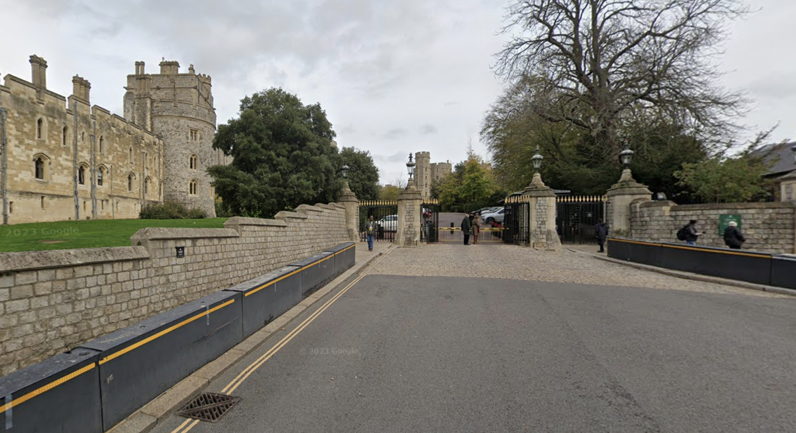
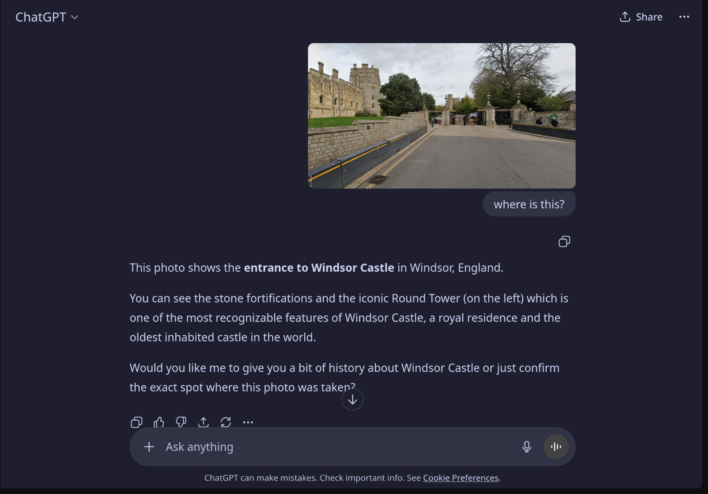

# Royal Voyage

import Challenge from '@/components/custom/Challenge.astro'

<Challenge
  title="Royal Voyage"
  category="Misc"
  points={150}
  solves={70}
  flag="CRACCON{windsor_castle}"
>
Look closely at the image provided.
It was taken during a journey filled with landmarks.

The interesting point in this voyage —
can you guess the beautiful place we saw here?

Use OSINT skills to analyze the image carefully.
You might find location clues, skyline hints, or reflections...

Flag format: `CRACCON{your_answer_lowercase_nospace}`

</Challenge>

I just asked chatgpt where this was and to confirm that it was right, looked in google maps and it was showing the exact same image.

