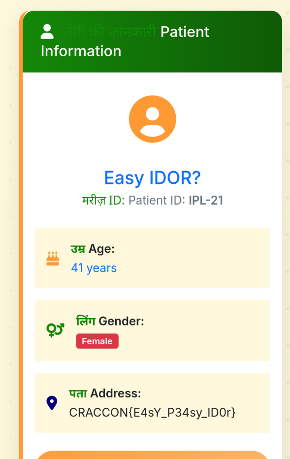

# BharatPathoLabs-Extract

import Challenge from '@/components/custom/Challenge.astro'

<Challenge
  title="BharatPathoLabs-Extract"
  category="Web"
  points={100}
  solves={34}
  flag=" CRACCON{E4sY_P34sy_ID0r}"
>
 BharatPatholabs is an emerging Indian pathology lab software designed to help technicians quickly generate reports and deliver them to patients online. The company claims their system is fast, paperless, and secure. But security is only as strong as the code behind it. Somewhere deep inside, the way reports are created and how patient data is accessed may not be as safe as advertised. Use this test credentials to access the portal: labtech: labtech123 Can you find the secret that one of the patient hides? 

 http://craccon.ctf.defhawk.com:8090/login
</Challenge>

After logging in, we can see the patient list and it displays `Showing 5 of 21 patients` at the bottom. And pressing the view button shows us some info about a specific patient. If we look at the URL we can see that we can access others that weren't there in the table like patient with ID `6` and so on.
So I immediately tried accessing patient with ID `21` and got the flag

