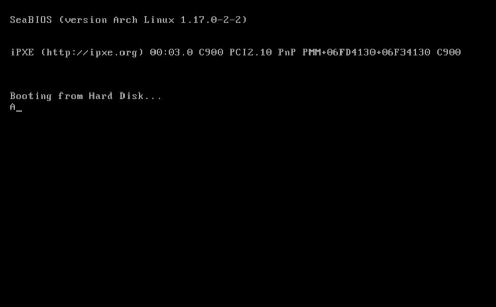
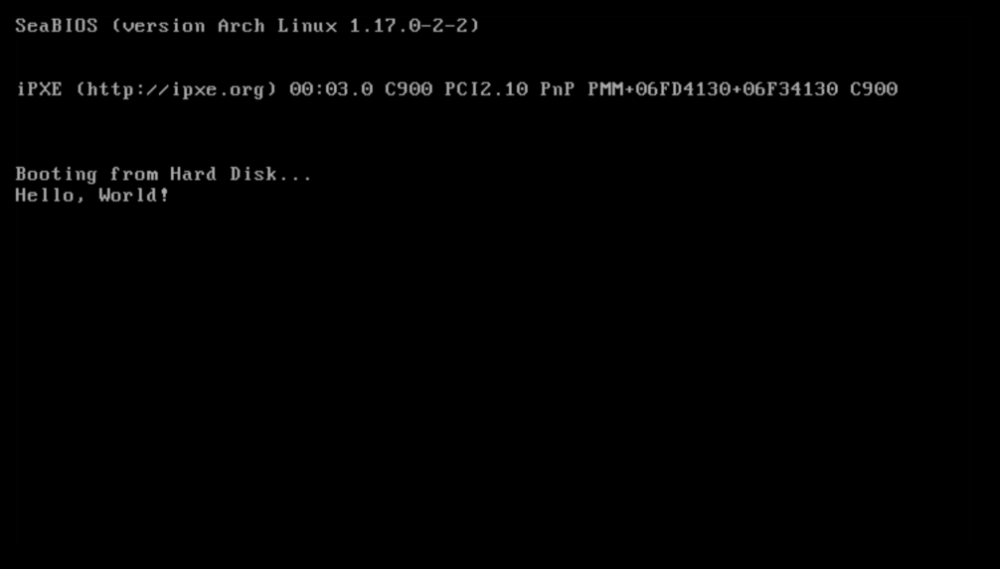

# Requirements

Make sure you have a linux environment with `nasm` and `qemu` installed. You can install them using your package manager.

# Printing a letter to the screen

To print something to the screen, we need to write a bootloader. A bootloader is a small piece of code that runs when the computer starts up. It is responsible for loading the kernel into memory and transferring control to it.
On the x86, the boot loader runs in Real Mode. Consequently it has easy access to BIOS resources and functions.

For printing to the screen, we can use the BIOS interrupt `0x10`. This interrupt provides various video services, including printing characters to the screen.
You can check out the [Ralf brown's interrupt list](https://www.ctyme.com/intr/int-10.htm) for more details on the available functions.

So for printing a character, we can use the `0Eh` function of the `0x10` interrupt. This function takes the character to be printed in the `AL` register.

So to write the letter `A` to the screen, we can use the following code:

```asm title=boot.asm
ORG 0x7C00
BITS 16

mov ah, 0eh  ; Set the function number for teletype output
mov al,'A'   ; Load the character 'A' into AL
int 0x10     ; Call the BIOS video interrupt to print the character
jmp $


TIMES 510-($-$$) db 0
DW 0xAA55
```

`ORG 0x7C00`: Tells the assembler to assemble the instructions from origin `0x7C00`. BIOS loads bootloader at physical address 0x7C00 hence we have to assemble our bootloader starting from that location.

`BITS 16`: This is an assembler directive. This will tell assembler that our code is a 16 bit code.

`jmp $`: `JMP` at location `$` means jumping to the same location. This is just an infinite loop. We just want to hang our code here.

`TIMES 510 - ($ - $$) db 0`: As bootloader is always of length 512 bytes, our code does not fit in this size as its small. We need to use rest of memory and hence we clear it out using `TIMES` directive. `$` stands for start of instruction and `$$` stands for start of program. Thus `($ - $$)` means length of our code.

`DW 0xAA55`: This is boot signature. This tells the BIOS that this is a valid bootloader. If bios does not get `0x55` and `0xAA` at the end of the bootloader than it will treat bootloader as invalid. Thus we provide this two bytes at the end of our bootloader.

Now to compile this code, we can use the following command:

```bash
nasm -f bin boot.asm -o boot.bin
```

And to run it using qemu, we can use the following command:

```bash
qemu-system-x86_64 boot.bin
```

And tada! You should see the letter `A` printed on the screen. Congratulations on writing your first bootloader!


# Printing "Hello world!"

Now that we have printed a single character to the screen, let's print "Hello world!" to the screen.

For this, we can use the same `0Eh` function of the `0x10` interrupt, but this time we will need to print each character of "Hello world!" one by one.
We can store the string "Hello world!" in the memory and then use a loop to print each character until we reach the null terminator.

Here is the modified code to print "Hello world!":

```asm title=boot.asm {4-5,8-22}
ORG 0x7c00
BITS 16

mov si, message    ; Loads the address of the message into SI
call print
jmp $

print:             ; Prints the string at SI until it reaches the null terminator
  lodsb            ; Loads the byte at SI into AL and increments SI
  cmp al, 0        ; Checks if the byte is the null terminator
  je .done         ; If it is the null terminator, jump to .done
  call print_char  ; If not, print the character in AL
  jmp print        ; Continue the loop to print the next character
.done:
  ret

print_char:        ; Prints the character in AL to the screen
  mov ah, 0eh
  int 0x10
  ret

message: db "Hello, World!", 0

TIMES 510-($-$$) db 0
DW 0xAA55
```

And we finally get our hello world!

